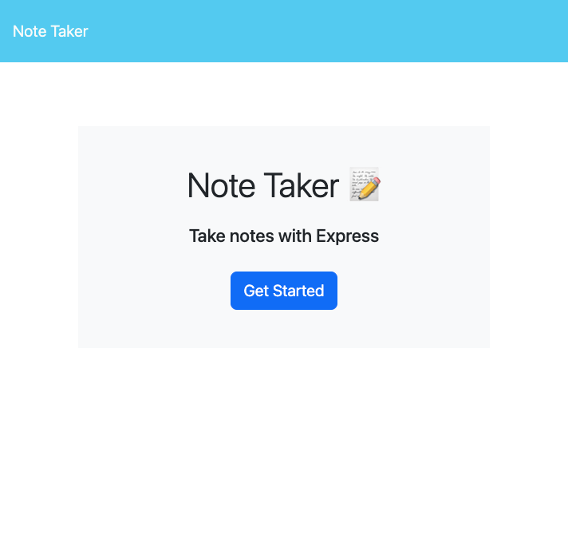
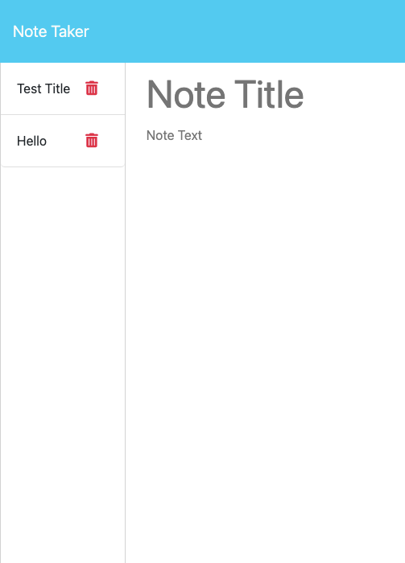

# note-taker

## Description
This repository contains HTML, CSS, and JavaScript files that use Node and Express.js to store and retrieve notes from a JSON fie. The user is taken to the Notes landing page where there is a link to the notes the user has created. When they click on the "Get Started" button they are then taken to the notes page. Here they can view old notes they have made and save new ones. This application is perfect for anyone who loves to take notes and wants the ability to access them wherever they go!

## Image of the site

## Link to deployed site

https://note-taker-bcs-60bb581a6a64.herokuapp.com/

